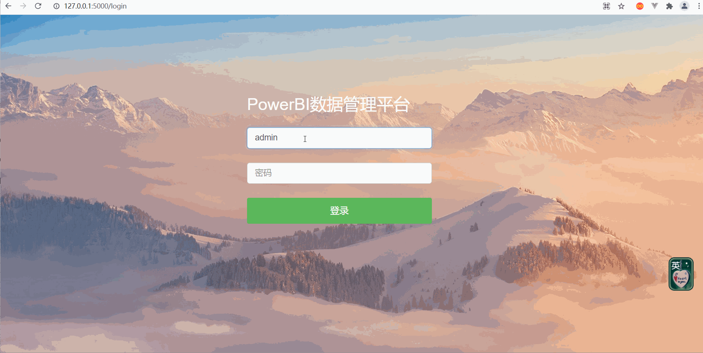

### 说明
使用flask,实现的简单的基于session的登录案例

### 启动方式
>Linux
```shell
python -m venv ./venv
source ./venv/Scripts/activate
pip install -r requirements.txt
python app.py
```

>windows
```shell
python -m venv ./venv
./venv/Scripts/activate
pip install -r requirements.txt
python app.py
```

### 使用图示



### 可配置项
1、默认用户名:`admin`,密码:`admin123`